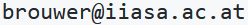

## MIND STEP toolbox at IIASA

This site provides guidance on access and use of [MIND STEP](https://mind-step.eu/) infrastructure hosted at [IIASA](https://iiasa.ac.at/).

### Subversion server

A [Subversion](https://subversion.apache.org/) repository can be obtained for hosting MIND-STEP-related code and data. Repositories can be accessed with a Subversion client (e.g. [TortoiseSVN](https://tortoisesvn.net/)) or from a CI server via a URL of the form `https://svnesm.iiasa.ac.at/svn/myrepo` where 'myrepo' is the name of the repository you obtained. To obtain a repository, email to  and suggest a name. Your request will be verified and forwarded to the IIASA ICT department who will contact you by email with the credentials (username and password).

### Jenkins server

A [Jenkins](https://www.jenkins.io/) Continuous Integration (CI) server is available at [https://mind-step-ci.iiasa.ac.at](https://mind-step-ci.iiasa.ac.at) for hosting test and integration automation jobs. These jobs can be configured and managed via the web interface available under the given link. Job configuration can also be contained in a [Jenkinsfile](https://www.jenkins.io/doc/book/pipeline/jenkinsfile/) stored in your repository. To obtain access, email to . Your request will be verified and forwarded to the IIASA ICT department who will contact you by email with the credentials (username and password).
