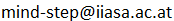

## MIND STEP toolbox at IIASA

This site provides guidance on access and use of [MIND STEP](https://mind-step.eu/) infrastructure hosted at [IIASA](https://iiasa.ac.at/). This involves servers for [Subversion](https://subversion.apache.org/), [Jenkins](https://www.jenkins.io/), and [GitLab](https://en.wikipedia.org/wiki/GitLab).

### Table of Contents

* [Getting started](#getting-started)
* [Access](#access)
  + [Subversion server](#subversion-server)
  + [Jenkins server](#jenkins-server)
  + [GitLab server](#gitlab-server)
* [Privacy](#privacy)
* [Basic use](#basic-use)
  + [Subversion](#subversion)
  + [Jenkins](#jenkins)
  + [GitLab](#gitlab)

### Getting started

To start, it is important to realize that the purposes of the Subversion server (hosting [version control](https://en.wikipedia.org/wiki/Version_control) repositories) and Jenkins server (running test/CI/CD [pipelines](https://www.jenkins.io/solutions/pipeline/)) are also covered by GitLab. It is just that GitLab hosts [Git](https://git-scm.com/) instead of Subversion repositories and has [a different way](https://docs.gitlab.com/ee/ci/quick_start/) of setting up pipelines. In addition, GitLab offers further features that are absent from Subversion + Jenkins: making a repository [public](https://docs.gitlab.com/ee/public_access/public_access.html), custom [wikis](https://docs.gitlab.com/ee/user/project/wiki), [issue tracking](https://docs.gitlab.com/ee/user/project/issues/), and more. Which combination of services to pick depends on your wants and needs:

- If you want a Git repostiory, use GitLab
- If you want a Subversion repository, use the Subversion server.
- If you want to use GitLab pipelines, storing code in a GitLab Git repository makes life easiest.
- If you need to test code in a GitLab Git repository, it is easiest to use a GitLab pipeline, but Jenkins can be made to work as well.
- If you need to test code in a Subversion repository, use Jenkins.
- If you need to make code or data public, use GitLab.
- ...

So what kind of repository should you want? You may be familiar with the very user friendly TortoiseSVN Subversion client and therefore believe that you should use a Subversion repository. However, it is important to realize that Subversion is quite basic: it supports only a simple centralized workflow. Git is more modern and scalable by virtue of a distributed architecture that supports advanced workflows. See [this chapter](https://git-scm.com/book/en/v2/Distributed-Git-Distributed-Workflows) in the online Git SCM book to learn more about workflows. Particularly when collaborating accross teams or organizations do advanced workflows become necessary.

An important consideration in choosing the test/CI/CD platform is the level of integration. To integrate, Jenkins uses plug-ins that talk to different kinds of version control systems and need to be configured with URLs and credentials. Getting a Jenkins pipeline going therefore requires considerable manual effort and knowledge of subsystems. GitLab has Git repository hosting built-in as well as other services. Integration of these services with pipelines is mostly provided for, yielding a much smoother experience.

Having explored the above considerations and links for your use cases and subsequently determined what MIND STEP infrastructure services you probably require, please acquire access to the required server or servers via the procedures detailed below.

### Access

#### Subversion server

A [Subversion](https://subversion.apache.org/) repository can be obtained for hosting MIND-STEP-related code and data. Repositories can be accessed with a Subversion client (e.g. [TortoiseSVN](https://tortoisesvn.net/)) or from a CI server via a URL of the form `https://svnesm.iiasa.ac.at/svn/myrepo` where 'myrepo' is the name of the repository you obtained. To obtain a repository, email to  and suggest a name. Your request will be verified and forwarded to the IIASA ICT department who will contact you by email with the credentials (username and password).

#### Jenkins server

A [Jenkins](https://www.jenkins.io/) Continuous Integration (CI) server is available at [https://mind-step-ci.iiasa.ac.at](https://mind-step-ci.iiasa.ac.at) for hosting test and integration automation jobs. These jobs can be configured and managed via the web interface available under the given link. Job configuration can also be contained in a [Jenkinsfile](https://www.jenkins.io/doc/book/pipeline/jenkinsfile/) stored in your repository. To obtain access, email to . Your request will be verified and forwarded to the IIASA ICT department who will contact you by email with the credentials (username and password).

#### GitLab server

A [GitLab](https://en.wikipedia.org/wiki/GitLab) CI server is available at [https://gitlab.iiasa.ac.at](https://gitlab.iiasa.ac.at) to MIND STEP partners. Once your account is approved, it is possible to create projects with an associated Git repository, wiki, issue tracker, and CI/CD pipeline. These assets can be made public (visible to anyone) or kept private. 

### Privacy

All three servers are hosted on IIASA premises, not in the cloud. Therefore any privacy sensitive information such as FADN data that is stored or processed is well-proteced provided that you use private GitLab repositories and guard passwords well.

### Basic use

This section discusses basic use after having acquired access to each of the services.

#### Subversion

Once provided with a repository URL and credentials, you require a Subversion client to access the repository. This can be either the default [Command Line Client](http://svnbook.red-bean.com/en/1.7/svn-book.html#svn.ref.svn) or a graphical client such as [TortoiseSVN](https://tortoisesvn.net/) for Windows. Next check that you understand the [fundamental concepts](http://svnbook.red-bean.com/en/1.7/svn-book.html#svn.basic) and make sure that you are familiar with [basic use](http://svnbook.red-bean.com/en/1.7/svn-book.html#svn.tour). You should then be ready to pick a [repository layout](http://svnbook.red-bean.com/en/1.7/svn-book.html#svn.tour.importing.layout) and start to [import files and directories](http://svnbook.red-bean.com/en/1.7/svn-book.html#svn.tour.importing.import) into the repository.

#### Jenkins

When provided with Jenkins credentials, verify that you can sign in at https://mind-step-ci.iiasa.ac.at/. The Jenkins User Handbook details [usage](https://www.jenkins.io/doc/book/using/) and also provides a more hands-on [guided tour](https://www.jenkins.io/doc/pipeline/tour/hello-world/). To start configuring a new project/job, go to the dashboard view (click 'Dashboard' on the top left), and click on 'New Item' below there.

#### GitLab

After your GitLab account has been approved, please check that you can sign in at https://gitlab.iiasa.ac.at. Once signed in, you can click 'New project' to create a [project](https://docs.gitlab.com/ee/user/project/). This gives you a Git repository with attached services to play with. Usage is documented in the online [user documentation](https://docs.gitlab.com/ee/user/index.html). Note that for extra security, it is highly recommended to set up [2-factor authentication](https://docs.gitlab.com/ee/user/profile/account/two_factor_authentication.html#enabling-2fa).

On the IIASA GitLab, a [MIND STEP group](https://gitlab.iiasa.ac.at/mind-step) has been created under which you are requested to organize your MIND-STEP-related projects. To become a member of this group please send a request to . You can create [subroups](https://docs.gitlab.com/ee/user/group/subgroups/) under this group to better organize and classify your projects. This determines the URL at which your projects are located and optionally made public: `https://gitlab.iiasa.ac.at/mind-step/<subgroup>/<project>`.
